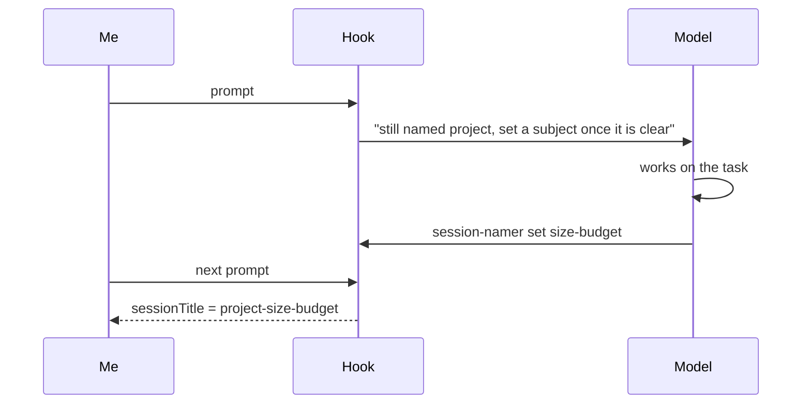

I run several Claude Code sessions side by side, across a handful of projects, and they work together: one session can hand a task to another by name. That only works if names are predictable, so they are not left to chance. A small wrapper around `claude` names every session at launch after its folder (`claude -n project`).

That settles who is who, but a name chosen at launch knows where a session runs, never what it is about. And `-n` also switches off Claude Code's own content-based titles. After a few weeks, `/resume` offers a long list of `project`, `project`, `project`, and I have to open each one to remember what it was about.

What I wanted was `project-<subject>`: the folder plus what the session actually worked on.

My real setup is a bit more involved than this, with more folders and a few more naming rules. I've boiled it down to a single `project` here so the post stays on the part worth reading: generating the name.

## The instruction that did not stick

My first fix was a line in my global `CLAUDE.md`: after your first substantive report, offer `/rename <project>-<subject>`.

It half-worked. Sometimes the model remembered, sometimes it did not, and when it did I still had to copy the command and run it. A rule that depends on the model remembering, and then on me doing the last step, is two chances to fail.

## Hooks can set the title

The useful discovery: a `UserPromptSubmit` hook can return a `sessionTitle`. I found it in the hook output schema of Claude Code 2.1.284, the version I had installed, then checked it with a throwaway run: a hook that returns

```json
{
  "hookSpecificOutput": {
    "hookEventName": "UserPromptSubmit",
    "sessionTitle": "probe-title-works"
  }
}
```

gets recorded in the transcript as a `custom-title` entry, exactly the way `/rename` records one.

So the mechanism exists. The harder question is who decides the subject, because a hook is a shell script and cannot read intent.

## Asking another model was the wrong idea

My first version ran a background job that sent the opening prompts to Haiku and asked for a short slug. It had three problems:

- **Cost and latency.** A headless `claude -p` call took about six and a half seconds, so it had to run in the background, and it spent tokens on every session for a cosmetic feature.

- **A second reader.** Another model was now reading my prompts just to name a tab.

- **It did not name anything.** Given an opening question, Haiku did what models do with a question: it answered it, in three paragraphs.

The model already in the conversation knows the subject better than anything I could bolt on. It just has no way to set the title, and the hook does.

## Two halves

So the job is split between the one that knows the subject and the one allowed to set the title:



- **The hook** runs on every prompt. While the session still has its launch name, it adds one line to the model's context (`additionalContext`) saying so, with the exact command to run. Once a subject is waiting, it returns it as `sessionTitle` instead.

- **The model** runs `session-namer set <subject>` from its shell, silently, once the task has a shape. The script finds the session through `CLAUDE_CODE_SESSION_ID`, which Claude Code exports to the shell the model runs commands in, checks that the subject is short and valid, and leaves it in a small state file for the hook's next pass.

The title lands one prompt after the model sets the subject, since the hook only runs when I send something. In practice that is one message of delay.

## The code

Here's the whole thing. It's one zsh script with two entry points, cut down to the single-`project` setup this post uses. It needs `jq` and nothing else. Mine lives in `~/.local/bin/session-namer`, so the model can call it by name.

```shell
#!/usr/bin/env zsh
# session-namer: `project` becomes `project-<subject>`, the subject chosen by
# the session's own model.
#   session-namer          UserPromptSubmit hook: nudge, or apply the title
#   session-namer set <s>  run by the model: validate and store the subject

config_dir="${CLAUDE_CONFIG_DIR:-$HOME/.claude}"
state_root="${TMPDIR:-/tmp}/session-namer"

# Claude Code keeps one JSON file per live session, holding its current name.
# A headless run has no interactive entry, so it is skipped here.
read_session() {
  setopt local_options null_glob
  local -a files=("$config_dir"/sessions/*.json)
  (( ${#files} )) || return 1
  local entry
  entry="$(jq -r --arg sid "$1" \
    'select(.sessionId == $sid and .kind == "interactive") | [.name, .cwd] | @tsv' \
    "${files[@]}" 2>/dev/null | head -1)"
  [[ -n "$entry" ]] || return 1
  name="${entry%%$'\t'*}"
  project="${${entry#*$'\t'}:t}"
}

# The launch name is the folder name. Anything else was typed with /rename,
# or already set by this hook, and is left alone.
has_launch_name() { read_session "$1" && [[ "$name" == "$project" ]] }

run_hook() {
  local input session_id prompt subject_file
  input="$(cat)"
  session_id="$(jq -r '.session_id // empty' <<< "$input")"
  prompt="$(jq -r '.prompt // empty' <<< "$input")"
  [[ -n "$session_id" && "$prompt" != /rename* ]] || return 0
  has_launch_name "$session_id" || return 0

  subject_file="$state_root/$session_id"
  if [[ -s "$subject_file" ]]; then
    jq -n --arg t "$project-$(<"$subject_file")" \
      '{hookSpecificOutput: {hookEventName: "UserPromptSubmit", sessionTitle: $t}}'
    return 0
  fi

  jq -n --arg m "This session is still named \`$name\`. Once its subject is clear, run \`session-namer set <subject>\` (1-3 lowercase kebab-case words naming the task), silently." \
    '{hookSpecificOutput: {hookEventName: "UserPromptSubmit", additionalContext: $m}}'
}

run_set() {
  local subject="${(L)1}" session_id="${CLAUDE_CODE_SESSION_ID:-}"
  [[ -n "$session_id" ]] || { print -u2 "run this from a Claude Code session"; return 1; }
  [[ "$subject" =~ '^[a-z0-9]+(-[a-z0-9]+){0,2}$' ]] ||
    { print -u2 "'$1' is not 1-3 kebab-case words"; return 1; }
  has_launch_name "$session_id" || { print -u2 "already named; nothing to do"; return 1; }

  subject="${subject#$project-}"
  (( ${#project} + 1 + ${#subject} <= 40 )) || { print -u2 "title over 40 characters"; return 1; }

  mkdir -p "$state_root" && print -r -- "$subject" >| "$state_root/$session_id"
  print "\`$project-$subject\` applies on the next prompt"
}

case "${1:-}" in
  "")  run_hook; exit 0 ;;
  set) shift; run_set "$@" ;;
  *)   print -u2 "usage: session-namer [set <subject>]"; exit 2 ;;
esac
```

Four parts of it need explaining.

### Where the current name lives

The hook's input carries the session ID and the prompt, but not the session's name. The name sits in `~/.claude/sessions/`, one small JSON file per running session, and it's the live value: both `/rename` and `sessionTitle` update it. `read_session` scans those files for our ID and pulls out two fields, the name and the working directory.

The same lookup also skips headless runs. A headless `claude -p` run has no `interactive` entry there, so the `select` finds nothing, `read_session` fails, and the hook exits without a word. There's no separate check for it.

### Deciding whether to touch it

`has_launch_name` is the whole policy in one line: the name is a launch name if it equals the folder's name. `${…:t}` is zsh for "the last path component", so `/Users/me/Projects/project` gives `project`.

Anything else means a person or this script already chose the name, and the hook goes quiet for good. There's no "already renamed" flag to store or clean up: once the title changes, the name stops matching the folder, and the hook stops acting.

### The hook half

`run_hook` reads the event JSON from stdin, bails on a `/rename` prompt, then does one of two things.

If a subject is waiting in the state file, it returns `sessionTitle`. If not, it returns `additionalContext`, a line Claude Code adds to what the model sees for that turn, with the exact command to run. The model never reads the script; it only ever sees that one sentence.

Every early exit is `exit 0` with no output. A `UserPromptSubmit` hook that exits with 2 blocks the prompt outright, and any other failure puts an error in front of me. So when anything is off, the hook says nothing and the prompt goes through untouched.

### The model's half

`run_set` is what the model runs from its shell. It has no session ID in its arguments, and doesn't need one: Claude Code exports `CLAUDE_CODE_SESSION_ID` to the shell the model runs commands in, which is how the script knows which session is asking.

Next, it checks the subject. `${(L)1}` lowercases the input; the regex allows one to three kebab-case words and nothing else, so a sentence, a path or a stray backtick is refused with a message the model can read and act on. `${subject#$project-}` strips the project name if the model repeated it, so `project-size-budget` becomes `size-budget` rather than `project-project-size-budget`. The 40-character cap keeps the title readable in the picker.

The subject is written to a file named after the session ID, under `$TMPDIR`. It only has to last until my next message.

## Wiring it up

The hook goes under `UserPromptSubmit` in `~/.claude/settings.json`:

```json
{
  "hooks": {
    "UserPromptSubmit": [
      {
        "hooks": [
          {
            "type": "command",
            "command": "$HOME/.local/bin/session-namer",
            "timeout": 5
          }
        ]
      }
    ]
  }
}
```

No `matcher`: `UserPromptSubmit` fires on every prompt, which is what the nudge needs. The five-second timeout is a ceiling, not an estimate: the script is a few `jq` calls and runs in under a tenth of a second.

## Guardrails

- **Only launch names get replaced.** A name I typed with `/rename` stays. That also makes the rename happen once: after the first title, the session no longer has its launch name, so the hook goes quiet.

- **Headless runs are skipped**, since they have no title to fix, and so is a prompt that is itself a `/rename`, which should simply win.

- **The subject is kept on a short leash:** one to three lowercase kebab-case words, at most 40 characters for the whole title, and the project name is stripped if the model repeats it. A chatty reply cannot become a title.

## Trying it

I opened a new session. I said "hello, what's up?" and nothing happened, which is right: there was no subject yet. Then I asked it to look at a failing test that checks a config file stays under its size budget. On my next message, the status bar showed the new title: the project name followed by `size-budget`.

The payoff is in `/resume`. Here is the same picker before and after, with subjects from a few days of real work on one repo:

```text
before                         after
───────────────────────────    ─────────────────────────────
project                        project-size-budget
project                        project-session-rename-hook
project                        project-opencode-guardrails
project                        project-symlink-session-lookup
project                        project-zsh-history-trap
```

The left column is five identical rows, and I would have to open each one to find the right session. On the right, I can pick one without opening anything.

## Caveats

- It still relies on the model following the nudge. The nudge repeats on every prompt until it does, which has been enough so far.

- `sessionTitle` is something I found in the schema and confirmed by testing on 2.1.284. I don't know which release introduced it, so check yours before you build on it.