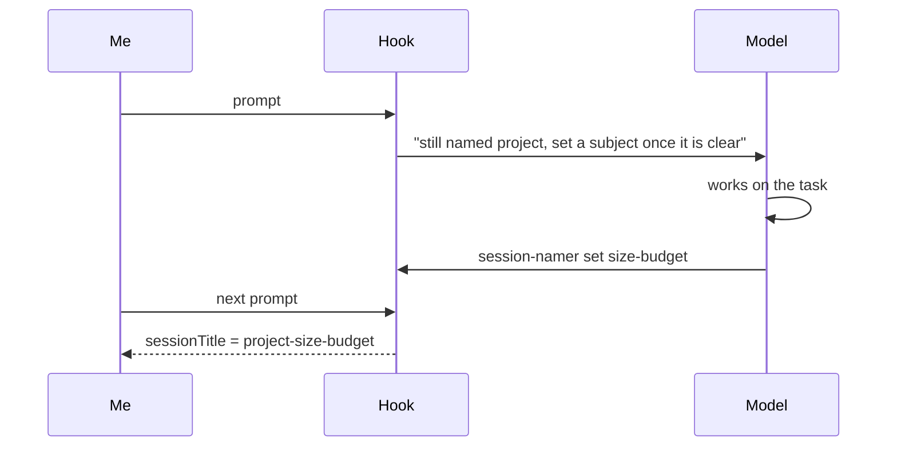

I run several Claude Code sessions side by side, across a handful of projects, and they work together: one session can hand a task to another by name. That only works if names are predictable, so they are not left to chance. A small wrapper around `claude` names every session at launch after its folder (`claude -n project`).

That settles who is who, but a name chosen at launch knows where a session runs, never what it is about. And `-n` also switches off Claude Code's own content-based titles. After a few weeks, `/resume` offers a long list of `project`, `project`, `project`, and I have to open each one to remember what it was about.

What I wanted was `project-<subject>`: the folder plus what the session actually worked on.

My real setup is a bit more involved than this, with more folders and a few more naming rules. I've boiled it down to a single `project` here so the post stays on the part worth reading: generating the name.

## The instruction that did not stick

My first fix was a line in my global `CLAUDE.md`: after your first substantive report, offer `/rename <project>-<subject>`.

It half-worked. Sometimes the model remembered, sometimes it did not, and when it did I still had to copy the command and run it. A rule that depends on the model remembering, and then on me doing the last step, is two chances to fail.

## Hooks can set the title

The useful discovery: a `UserPromptSubmit` hook can return a `sessionTitle`. I found it in the hook output schema of Claude Code 2.1.284, the version I had installed, then checked it with a throwaway run: a hook that returns

```json
{
  "hookSpecificOutput": {
    "hookEventName": "UserPromptSubmit",
    "sessionTitle": "probe-title-works"
  }
}
```

gets recorded in the transcript as a `custom-title` entry, exactly the way `/rename` records one.

So the mechanism exists. The harder question is who decides the subject, because a hook is a shell script and cannot read intent.

## Asking another model was the wrong idea

My first version ran a background job that sent the opening prompts to Haiku and asked for a short slug. It had three problems:

- **Cost and latency.** A headless `claude -p` call took about six and a half seconds, so it had to run in the background, and it spent tokens on every session for a cosmetic feature.

- **A second reader.** Another model was now reading my prompts just to name a tab.

- **It did not name anything.** Given an opening question, Haiku did what models do with a question: it answered it, in three paragraphs.

The model already in the conversation knows the subject better than anything I could bolt on. It just has no way to set the title, and the hook does.

## Two halves

So the job is split between the one that knows the subject and the one allowed to set the title:



- **The hook** runs on every prompt. While the session still has its launch name, it adds one line to the model's context (`additionalContext`) saying so, with the exact command to run. Once a subject is waiting, it returns it as `sessionTitle` instead.

- **The model** runs `session-namer set <subject>` from its shell, silently, once the task has a shape. The script finds the session through `CLAUDE_CODE_SESSION_ID`, which Claude Code exports to the shell the model runs commands in, checks that the subject is short and valid, and leaves it in a small state file for the hook's next pass.

The title lands one prompt after the model sets the subject, since the hook only runs when I send something. In practice that is one message of delay.

## The code

Here's the whole thing: one zsh script, about 120 lines, cut down to the single-`project` setup this post uses. It needs `jq` and nothing else. Mine lives in `~/.local/bin/session-namer`, so the model can call it by name.

It's written to be read rather than to be short, so it's in three parts, the same three the rest of this section walks through.

```shell
#!/usr/bin/env zsh
# Renames a session from `project` to `project-<subject>`.
#
#   session-namer               called by Claude Code on every prompt (the hook)
#   session-namer set <subject> called by the model, once it knows the subject

sessions_dir="${CLAUDE_CONFIG_DIR:-$HOME/.claude}/sessions"
subjects_dir="${TMPDIR:-/tmp}/session-namer"

# ── Shared ───────────────────────────────────────────────────────────────────

# Looks up a running session and sets two variables:
#   session_name  its current title, e.g. "project"
#   project       the name of the folder it was started in
find_session() {
  local session_id="$1"
  local session_file

  for session_file in "$sessions_dir"/*.json(N); do
    if [[ "$(jq -r '.sessionId' "$session_file")" == "$session_id" &&
          "$(jq -r '.kind' "$session_file")" == "interactive" ]]; then
      session_name="$(jq -r '.name' "$session_file")"
      project="$(basename "$(jq -r '.cwd' "$session_file")")"
      return 0
    fi
  done

  return 1  # not found: a headless run, or not a session at all
}

# A session still has its launch name when its title is just the folder name.
still_has_launch_name() {
  find_session "$1" && [[ "$session_name" == "$project" ]]
}

# ── The hook ────────────────────────────────────────────────────────────────

run_hook() {
  local event session_id prompt
  event="$(cat)"
  session_id="$(jq -r '.session_id' <<< "$event")"
  prompt="$(jq -r '.prompt' <<< "$event")"

  # A /rename the user is typing right now wins.
  if [[ "$prompt" == /rename* ]]; then
    return
  fi

  # Already renamed, by hand or by us: nothing left to do.
  if ! still_has_launch_name "$session_id"; then
    return
  fi

  local subject_file="$subjects_dir/$session_id"

  if [[ -f "$subject_file" ]]; then
    # The model has picked a subject: apply it as the session title.
    local title="$project-$(cat "$subject_file")"
    jq -n --arg title "$title" '{
      hookSpecificOutput: {
        hookEventName: "UserPromptSubmit",
        sessionTitle: $title
      }
    }'
  else
    # No subject yet: remind the model how to set one.
    local reminder="This session is still named '$session_name'. Once its subject is clear, run 'session-namer set <subject>' (1-3 lowercase words joined by hyphens), silently."
    jq -n --arg reminder "$reminder" '{
      hookSpecificOutput: {
        hookEventName: "UserPromptSubmit",
        additionalContext: $reminder
      }
    }'
  fi
}

# ── The model's command ──────────────────────────────────────────────────────

run_set() {
  local subject="${1:l}"                      # lowercase
  local session_id="$CLAUDE_CODE_SESSION_ID"  # exported by Claude Code

  if [[ -z "$session_id" ]]; then
    echo "Run this from inside a Claude Code session." >&2
    return 1
  fi

  # One to three words, lowercase letters and digits, joined by hyphens.
  if [[ ! "$subject" =~ '^[a-z0-9]+(-[a-z0-9]+){0,2}$' ]]; then
    echo "'$1' should be 1-3 words joined by hyphens, like 'size-budget'." >&2
    return 1
  fi

  if ! still_has_launch_name "$session_id"; then
    echo "This session already has a name; nothing to do." >&2
    return 1
  fi

  # If the model repeated the project name, drop it.
  subject="${subject#$project-}"

  local title="$project-$subject"
  if (( ${#title} > 40 )); then
    echo "'$title' is over 40 characters; pick a shorter subject." >&2
    return 1
  fi

  mkdir -p "$subjects_dir"
  echo "$subject" >| "$subjects_dir/$session_id"
  echo "The title '$title' applies on the next prompt."
}

# ── Entry point ──────────────────────────────────────────────────────────────

case "$1" in
  "")  run_hook; exit 0 ;;   # a hook must never block the prompt
  set) run_set "$2" ;;
  *)   echo "Usage: session-namer [set <subject>]" >&2; exit 2 ;;
esac
```

### The shared part: finding the session

The hook's input carries the session ID and the prompt, but not the session's title. The title lives in `~/.claude/sessions/`, where Claude Code keeps one small JSON file per running session, and it's always current: both `/rename` and `sessionTitle` update it. `find_session` goes through those files, finds ours, and reads two things from it: the title, and the folder the session was started in.

`still_has_launch_name` is the whole renaming policy in one line: if the title is still just the folder name, it's the launch name, and we may replace it. Anything else means someone already chose a name, so the script leaves it alone. There's no "already renamed" flag to keep: once the title changes, it stops matching the folder, and the script stops acting on its own.

The same lookup also skips headless runs. A `claude -p` run has no `interactive` entry there, so `find_session` finds nothing and the hook stays quiet.

### The hook: one of two answers

Claude Code runs `run_hook` on every prompt, passing a small JSON event on standard input. After the two early exits (a `/rename` being typed, or a session that already has a real name) it answers in one of two ways:

- **A subject is waiting**, so it returns `sessionTitle`, and Claude Code renames the session.

- **No subject yet**, so it returns `additionalContext`: a sentence Claude Code adds to what the model sees on that turn, with the exact command to run. The model never reads the script; that sentence is all it gets.

Every path through the hook ends in `exit 0`. A `UserPromptSubmit` hook that exits with 2 blocks the prompt outright, and any other failure puts an error in front of me, so when anything is off, the hook says nothing and the prompt goes through untouched.

### The model's command: checking the subject

`run_set` is what the model runs from its shell. It isn't told which session it's in, and doesn't need to be: Claude Code exports `CLAUDE_CODE_SESSION_ID` to the shell the model runs commands in.

Then it checks the subject before accepting it. It must be one to three lowercase words joined by hyphens, so a sentence, a path or a stray backtick is refused, with a message the model can read and correct. If the model repeated the project name, it's dropped, so `project-size-budget` becomes `size-budget` rather than `project-project-size-budget`. And the full title has to fit in 40 characters, so it stays readable in the picker.

The subject is saved to a file named after the session, under `$TMPDIR`. It only has to last until my next message, when the hook picks it up.

## Wiring it up

The hook goes under `UserPromptSubmit` in `~/.claude/settings.json`:

```json
{
  "hooks": {
    "UserPromptSubmit": [
      {
        "hooks": [
          {
            "type": "command",
            "command": "$HOME/.local/bin/session-namer",
            "timeout": 5
          }
        ]
      }
    ]
  }
}
```

There's no `matcher`, because `UserPromptSubmit` fires on every prompt, which is what the reminder needs. The five-second timeout is a ceiling, not an estimate: the script is a handful of `jq` calls and runs in well under a tenth of a second.

## Guardrails

- **Only launch names get replaced.** A name I typed with `/rename` stays. That also makes the rename happen once: after the first title, the session no longer has its launch name, so the hook goes quiet.

- **Headless runs are skipped**, since they have no title to fix, and so is a prompt that is itself a `/rename`, which should simply win.

- **The subject is kept on a short leash:** one to three lowercase kebab-case words, at most 40 characters for the whole title, and the project name is stripped if the model repeats it. A chatty reply cannot become a title.

## Trying it

I opened a new session. I said "hello, what's up?" and nothing happened, which is right: there was no subject yet. Then I asked it to look at a failing test that checks a config file stays under its size budget. On my next message, the status bar showed the new title: the project name followed by `size-budget`.

The payoff is in `/resume`. Here is the same picker before and after, with subjects from a few days of real work on one repo:

```text
before                         after
───────────────────────────    ─────────────────────────────
project                        project-size-budget
project                        project-session-rename-hook
project                        project-opencode-guardrails
project                        project-symlink-session-lookup
project                        project-zsh-history-trap
```

The left column is five identical rows, and I would have to open each one to find the right session. On the right, I can pick one without opening anything.

## Caveats

- It still relies on the model following the nudge. The nudge repeats on every prompt until it does, which has been enough so far.

- `sessionTitle` is something I found in the schema and confirmed by testing on 2.1.284. I don't know which release introduced it, so check yours before you build on it.