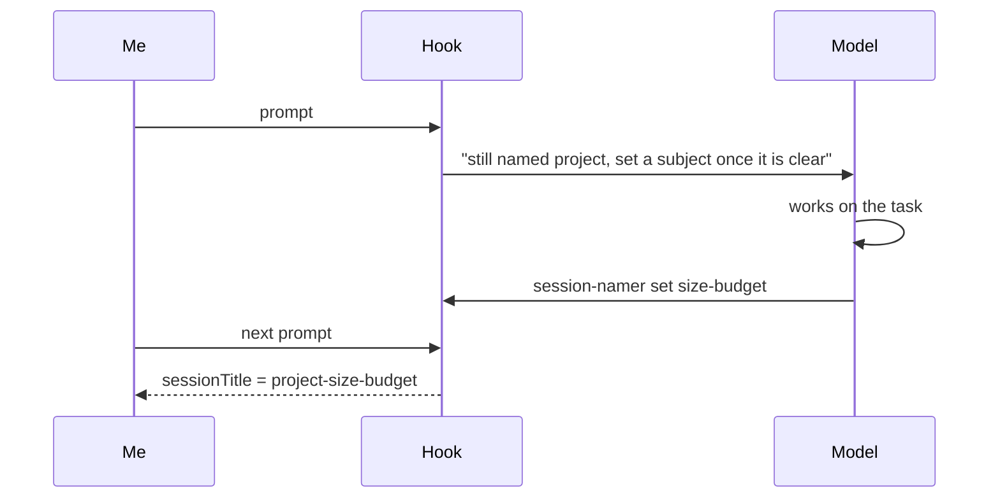

I run several Claude Code sessions side by side, across a handful of projects, and they work together: one session can hand a task to another by name. That only works if names are predictable, so they are not left to chance. A small wrapper around `claude` names every session at launch after its folder (`claude -n project`).

That settles who is who, but a name chosen at launch knows where a session runs, never what it is about. And `-n` also switches off Claude Code's own content-based titles. After a few weeks, `/resume` offers a long list of `project`, `project`, `project`, and I have to open each one to remember what it was about.

What I wanted was `project-<subject>`: the folder plus what the session actually worked on.

My real setup is a bit more involved than this, with more folders and a few more naming rules. I've boiled it down to a single `project` here so the post stays on the part worth reading: generating the name.

## The instruction that did not stick

My first fix was a line in my global `CLAUDE.md`: after your first substantive report, offer `/rename <project>-<subject>`.

It half-worked. Sometimes the model remembered, sometimes it did not, and when it did I still had to copy the command and run it. A rule that depends on the model remembering, and then on me doing the last step, is two chances to fail.

## Hooks can set the title

The useful discovery: a `UserPromptSubmit` hook can return a `sessionTitle`. I found it in the hook output schema of Claude Code 2.1.284, the version I had installed, then checked it with a throwaway run: a hook that returns

```json
{
  "hookSpecificOutput": {
    "hookEventName": "UserPromptSubmit",
    "sessionTitle": "probe-title-works"
  }
}
```

gets recorded in the transcript as a `custom-title` entry, exactly the way `/rename` records one.

So the mechanism exists. The harder question is who decides the subject, because a hook is a shell script and cannot read intent.

## Asking another model was the wrong idea

My first version ran a background job that sent the opening prompts to Haiku and asked for a short slug. It had three problems:

- **Cost and latency.** A headless `claude -p` call took about six and a half seconds, so it had to run in the background, and it spent tokens on every session for a cosmetic feature.

- **A second reader.** Another model was now reading my prompts just to name a tab.

- **It did not name anything.** Given an opening question, Haiku did what models do with a question: it answered it, in three paragraphs.

The model already in the conversation knows the subject better than anything I could bolt on. It just has no way to set the title, and the hook does.

## Two halves

So the job is split between the one that knows the subject and the one allowed to set the title:



- **The hook** runs on every prompt. While the session still has its launch name, it adds one line to the model's context (`additionalContext`) saying so, with the exact command to run. Once a subject is waiting, it returns it as `sessionTitle` instead.

- **The model** runs `session-namer set <subject>` from its shell, silently, once the task has a shape. The script finds the session through `CLAUDE_CODE_SESSION_ID`, which Claude Code exports to the shell the model runs commands in, checks that the subject is short and valid, and leaves it in a small state file for the hook's next pass.

The title lands one prompt after the model sets the subject, since the hook only runs when I send something. In practice that is one message of delay.

## Guardrails

- **Only launch names get replaced.** A name I typed with `/rename` stays. That also makes the rename happen once: after the first title, the session no longer has its launch name, so the hook goes quiet.

- **Headless runs are skipped**, since they have no title to fix, and so is a prompt that is itself a `/rename`, which should simply win.

- **The subject is kept on a short leash:** one to three lowercase kebab-case words, at most 40 characters for the whole title, and the project name is stripped if the model repeats it. A chatty reply cannot become a title.

## Trying it

I opened a new session. I said "hello, what's up?" and nothing happened, which is right: there was no subject yet. Then I asked it to look at a failing test that checks a config file stays under its size budget. On my next message, the status bar showed the new title: the project name followed by `size-budget`.

The payoff is in `/resume`. Here is the same picker before and after, with subjects from a few days of real work on one repo:

```text
before                         after
───────────────────────────    ─────────────────────────────
project                        project-size-budget
project                        project-session-rename-hook
project                        project-opencode-guardrails
project                        project-symlink-session-lookup
project                        project-zsh-history-trap
```

The left column is five identical rows, and I would have to open each one to find the right session. On the right, I can pick one without opening anything.

## Caveats

- It still relies on the model following the nudge. The nudge repeats on every prompt until it does, which has been enough so far.

- `sessionTitle` is something I found in the schema and confirmed by testing on 2.1.284. I don't know which release introduced it, so check yours before you build on it.