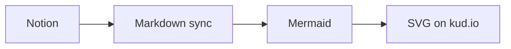

A quick rendering test.

```mermaid
flowchart LR
  A["Notion"] --> B["Markdown sync"]
  B --> C["Mermaid"]
  C --> D["SVG on kud.io"]
```

If this appears as a diagram rather than a code block, the pipeline works.